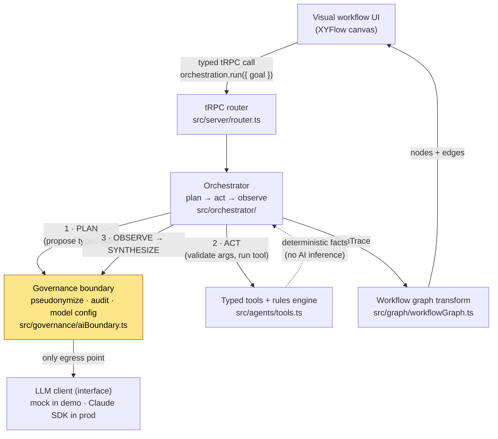

# Agentic Orchestrator — Architecture Demo

> **Sanitized demonstration extract of a production system (Orkestrator AI).**
> It illustrates the architecture and patterns; the production code is private.
> No production credentials, customer data, proprietary prompts, or business
> logic are included here. The whole thing runs against a **mock LLM** — no API
> key required to read, run, or reason about it.

---

## What this demonstrates

A small, strongly-typed TypeScript skeleton of an **agentic orchestration**
backend. It shows the four seams that matter in the real system:

1. **Typed agent-orchestration over tRPC** — the UI calls a single typed
   procedure (`orchestration.run`); input/output types flow end to end with no
   duplicated declarations. See [`src/server/router.ts`](src/server/router.ts).
2. **A plan → act → observe loop** — the model *proposes* a plan as data; the
   orchestrator *validates* it, executes typed tools, captures observations, and
   asks the model for a grounded synthesis. The model never controls execution.
   See [`src/orchestrator/orchestrator.ts`](src/orchestrator/orchestrator.ts).
3. **Claude SDK tool-use, behind one boundary** — tools are typed capabilities
   with validation + execution separated; the model can only ask for them by
   name with validated args. See [`src/agents/tools.ts`](src/agents/tools.ts).
4. **A clean separation of orchestration / agent steps / governance** — a
   single audited egress point to the LLM that pseudonymizes inputs and logs a
   *hash* of every prompt (never the body) plus token cost. See
   [`src/governance/aiBoundary.ts`](src/governance/aiBoundary.ts).

Plus a **visual workflow graph**: a pure transform from a run trace into
nodes + edges for a node-based canvas (XYFlow / React Flow in production). See
[`src/graph/workflowGraph.ts`](src/graph/workflowGraph.ts).

## Architecture



The single most important rule, enforced architecturally: **no file outside the
governance boundary may import or call the LLM client.** Everything reaches the
model through `askModel()`, which is where pseudonymization and audit live.

## How it maps to the real system

| This demo | Orkestrator AI (production) |
|---|---|
| `src/governance/aiBoundary.ts` | `src/server/ai/pseudonymize.ts` — the **only** file that imports `@anthropic-ai/sdk`; builds aliased bundles, hashes prompts into `app.ai_audit_log`, never stores prompt bodies |
| `src/agents/tools.ts` (deterministic rules engine) | `src/server/engine/conflicts.ts` — a pure-TS engine that decides hard facts (overload, time-clash, double-book, travel-impossible, …); the model only *explains* them |
| `src/orchestrator/orchestrator.ts` | The server-action / orchestration layer that fetches typed DTOs, runs the engine, and routes summaries through the AI boundary |
| `src/server/router.ts` (tRPC) | tRPC v11 + Next.js server actions over a typed `pg` query layer |
| `src/graph/workflowGraph.ts` | `src/app/graph/flowLayout.ts` — pure transform feeding the `@xyflow/react` visual canvas (the headline, visual-first UX) |
| Mock `LlmClient` | `@anthropic-ai/sdk` (`claude-sonnet-4-5`), wired only at the boundary |

Production stack: **Next.js (App Router, TS strict) · tRPC · Anthropic Claude
SDK · XYFlow · Supabase Postgres via typed `pg`**.

## Key design decisions & trade-offs

- **The model proposes, the orchestrator disposes.** Plans are *data*, parsed
  and validated before any tool runs. This is slower than letting the model
  free-run, but it makes every side effect typed, auditable, and replayable.
- **Hard facts are deterministic, never inferred.** A rules engine decides what
  is true (conflicts, overloads); the LLM only prioritizes and explains. This
  keeps the system trustworthy and the AI cost bounded.
- **One egress point for the model.** Centralizing pseudonymization + audit at a
  single boundary is the difference between "we hope no PII leaks" and "PII
  *cannot* leak without going through code we control." The trade-off is a hard
  architectural constraint every contributor must respect — enforced by review.
- **Audit without surveillance.** We log a SHA-256 of each prompt plus token
  counts and latency — enough to prove a call happened and what it cost, while
  storing none of the sensitive content.
- **Pure transforms for the UI.** The visual graph is computed from a `RunTrace`
  by a pure function, decoupled from React/XYFlow — trivial to test, easy to
  reason about.

## Run it

```bash
npm install
npm run demo        # runs the full plan→act→observe loop against the mock LLM
npm run typecheck   # tsc --noEmit
```

Expected output: the proposed plan, per-step observations from the deterministic
tools, a grounded natural-language synthesis, token cost, and the derived visual
workflow graph — all with **no API key**.

## File tree

```text
agentic-orchestrator-demo/
├── README.md
├── LICENSE                       MIT · Nikita Alexeev · 2026
├── package.json
├── tsconfig.json
├── .gitignore
├── .env.example                  placeholders only — the demo needs none
└── src/
    ├── types.ts                  the shared type contracts everything is built on
    ├── index.ts                  runnable entrypoint (npm run demo)
    ├── llm/
    │   └── mockLlm.ts            deterministic mock LlmClient (no key needed)
    ├── governance/
    │   └── aiBoundary.ts         single audited egress: pseudonymize + audit
    ├── agents/
    │   └── tools.ts              typed tools + deterministic rules engine
    ├── orchestrator/
    │   └── orchestrator.ts       the plan → act → observe loop
    ├── server/
    │   └── router.ts             stub tRPC router (typed RPC boundary)
    └── graph/
        └── workflowGraph.ts      RunTrace → nodes/edges (XYFlow-compatible)
```

---

← Portfolio: https://github.com/MOZARTINOS
